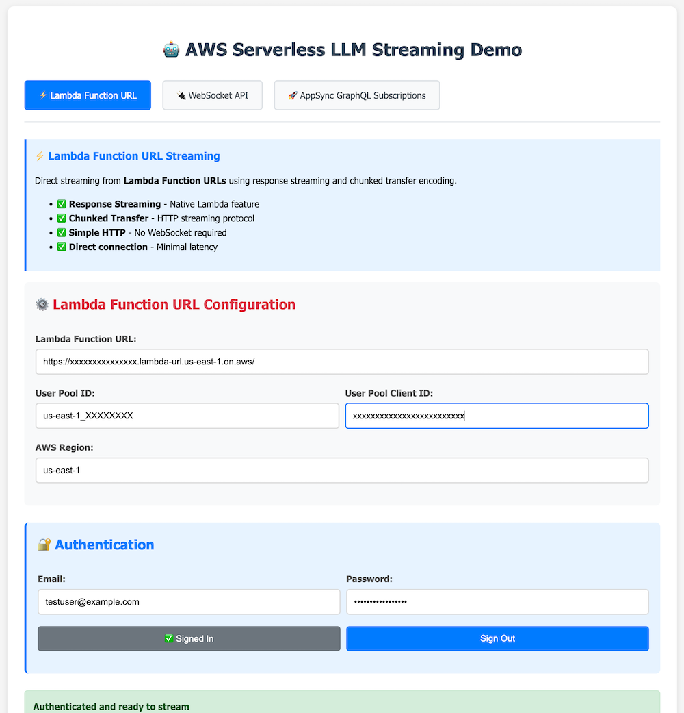
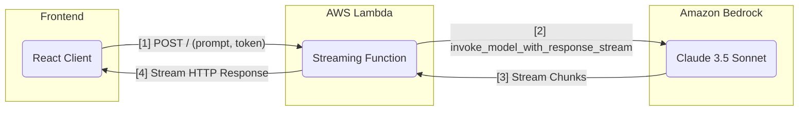
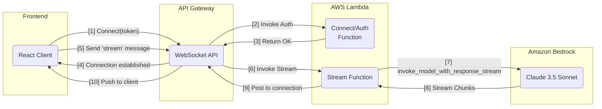
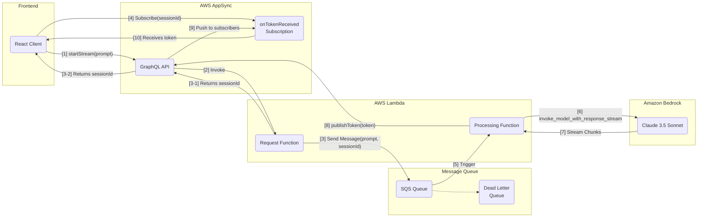

# Serverless Strategies for Streaming LLM Responses

This repository provides sample code for the blog post **"Serverless Strategies for Streaming LLM Responses"**. It demonstrates three serverless architectures for implementing real-time streaming from Large Language Models (LLMs) on AWS.

The focus is on demonstrating **true real-time streaming**, where tokens are delivered to clients as they are generated from Amazon Bedrock, not just simulated client-side streaming of a complete response.

> **DISCLAIMER**: These materials are intended for educational purposes only. The code samples and architectures demonstrated in this repository should not be deployed in production environments without additional security testing and hardening. While efforts have been made to follow best practices, production deployments require additional considerations around security, scalability, error handling, and compliance that may not be fully addressed in these examples.

## Client Application

The sample includes a React client application that lets you test all three streaming implementations side-by-side. The client provides a simple interface to interact with each serverless architecture, making it easy to compare their behavior and performance.



Each tab corresponds to one of the streaming architectures, allowing you to directly compare:
- Response speed and latency
- Streaming behavior
- Connection setup time
- Error handling

## Real-time Streaming Architectures

The sample demonstrates three serverless architectures for streaming Claude 3.5 Sonnet responses from Amazon Bedrock. Each has distinct advantages depending on the use case.

### 1. **Lambda Function URL with Response Streaming**
- **Runtime**: Node.js (a requirement of the Lambda response streaming feature)
- **Best for**: Simple, cost-effective use cases where a client can directly handle a streaming HTTP response. It's excellent for building custom backend APIs or for single-client scenarios.
- **Key Feature**: Utilizes the native response streaming capability of AWS Lambda, providing a direct, low-latency stream over HTTP from a single function.

### 2. **API Gateway WebSocket API**
- **Runtime**: Python (but supports all runtimes)
- **Best for**: Stateful, bidirectional, and interactive real-time applications. Ideal for chat applications or scenarios requiring persistent connections.
- **Key Feature**: Manages persistent WebSocket connections, allowing the backend to push messages to clients at any time. Provides fine-grained control over connections, messages, and authorization.

### 3. **AppSync with GraphQL Subscriptions and SQS**
- **Runtime**: Python
- **Best for**: Scalable, multi-client, and data-driven applications, especially those with existing GraphQL APIs or complex data requirements.
- **Key Feature**: A fully managed GraphQL service that simplifies data distribution. It uses a publish/subscribe model combined with SQS message queuing, providing loose coupling between components, automatic retries, and enhanced resilience.

## Implementation Overviews

Each architecture is implemented as a separate CDK stack.

### Lambda URL Streaming (`lib/lambda_url_streaming_stack.py`)
- **Core Component**: A single Node.js Lambda function.
- **Mechanism**: The function's URL is configured with `InvokeMode.RESPONSE_STREAM`. When invoked, the function's custom Node.js runtime handler writes chunks from the Bedrock stream directly to the HTTP response stream.
- **Authentication**: The client includes a Cognito JWT in the `Authorization` header. The Lambda function manually verifies the token.

> **⚠️ SECURITY WARNING**: Lambda Function URLs are publicly accessible endpoints by default. In this implementation, authentication happens at the application level (inside the Lambda code) rather than at the infrastructure level. This means that unauthenticated requests will still reach your Lambda function before being rejected. Ensure your token validation logic is robust and consider adding resource policies for production deployments to add an additional security layer. Any vulnerabilities in the validation logic could potentially allow unauthorized access to your LLM services.



### WebSocket API (`lib/websocket_api_streaming_stack.py`)
- **Core Component**: An API Gateway WebSocket API with multiple routes.
- **Mechanism**:
    1. The client connects to the `$connect` route, passing a Cognito JWT for authorization via a custom Lambda Authorizer.
    2. The client sends a `{"action": "stream", "prompt": "..."}` message.
    3. The `stream` route triggers a Python Lambda that invokes Bedrock.
    4. As tokens arrive, the Lambda uses the `connectionId` to post messages back to the client over the WebSocket connection.
- **State Management**: API Gateway manages the connection state, routing messages to the appropriate Lambda functions.



### AppSync GraphQL with SQS (`lib/appsync_streaming_stack.py`)
- **Core Components**: AWS AppSync GraphQL API with Amazon SQS for message-based processing.
- **Mechanism**:
    1. The client calls a `startStream` mutation. AppSync invokes a "Request" Lambda.
    2. The Request Lambda immediately returns a unique `sessionId` and sends the processing task to an SQS queue.
    3. The client uses the `sessionId` to subscribe to an `onTokenReceived` GraphQL subscription.
    4. The "Processing" Lambda (triggered by SQS) invokes Bedrock and, for each token, calls a `publishToken` mutation in AppSync.
    5. AppSync automatically pushes the token to all clients subscribed with the matching `sessionId`.
- **Decoupling Benefits**: 
    - Clean separation between request handling and processing
    - Enhanced resilience through SQS automatic retries and dead-letter queue
    - Better scalability with queue-based buffering
    - Improved error handling with SQS failure management



## Setup and Deployment

### Prerequisites

- AWS CLI configured with appropriate permissions
- Node.js 18+ and Python 3.9+
- AWS CDK CLI: `npm install -g aws-cdk`

### Quick Start

1.  **Clone the repository and install dependencies**:
    ```bash
    git clone https://github.com/your-repo/serverless-llm-streaming.git
    cd serverless-llm-streaming
    python3 -m venv .venv
    source .venv/bin/activate
    pip install -r requirements.txt
    ```

2.  **Configure AWS credentials**:
    ```bash
    aws configure
    ```

3.  **Deploy the stacks**:
    ```bash
    cdk deploy --all --require-approval never
    ```
    This command deploys all three streaming architectures and the shared authentication stack.

4.  **Run the Frontend Client**:
    The React-based client in the `streaming-clients` directory is configured to test all three solutions.
    ```bash
    cd streaming-clients
    # Copy the environment file template and configure it with your deployment values
    cp .env.example .env
    
    # Update the .env file with values from CDK output
    # (API URLs, Cognito IDs, etc. from CloudFormation outputs)
    
    npm install
    npm run dev
    ```
    The application will be available at `http://localhost:5173`. You will need to manually copy deployment values (like API URLs and Cognito IDs) from the CDK output to your `.env` file based on the template provided in `.env.example`.

5.  **Create a Test User Account**:
    After deployment, you'll need to create a test user in the Cognito User Pool to authenticate with the streaming APIs. Use the AWS CLI to create and confirm a user:

    ```bash
    # Get the User Pool ID from CDK output (look for AuthStack.UserPoolId)
    USER_POOL_ID="your-user-pool-id-from-cdk-output"
    
    # Create a test user
    aws cognito-idp admin-create-user \
        --user-pool-id $USER_POOL_ID \
        --username testuser \
        --user-attributes Name=email,Value=test@example.com \
        --temporary-password TempPassword123! \
        --message-action SUPPRESS
    
    # Set a permanent password (skip temporary password flow)
    aws cognito-idp admin-set-user-password \
        --user-pool-id $USER_POOL_ID \
        --username testuser \
        --password TestPassword123! \
        --permanent
    
    # Confirm the user account
    aws cognito-idp admin-confirm-sign-up \
        --user-pool-id $USER_POOL_ID \
        --username testuser
    ```

    You can now use these credentials (`testuser` / `TestPassword123!`) to sign in through the React client application.

    > **Note**: Replace `your-user-pool-id-from-cdk-output` with the actual User Pool ID from your CDK deployment output. You can find this value in the CloudFormation console under the AuthStack outputs or in the terminal output after running `cdk deploy`.

## Development Commands

-   `pip install -r requirements.txt`: Install Python dependencies for CDK.
-   `cdk deploy '*'`: Deploy a specific stack (e.g., `cdk deploy 'AppSyncStreamingStack'`).
-   `cdk diff`: Compare local changes to the deployed state.
-   `cdk destroy --all`: Destroy all resources created by the CDK.

## Project Structure

```
.
├── lambda_functions
│   ├── appsync               # Lambdas for AppSync (Request/Processing)
│   │   ├── request.py
│   │   └── processing.py
│   ├── lambda_url_streaming  # Node.js Lambda for Function URL Streaming
│   │   └── index.mjs
│   └── websocket_api         # Lambdas for WebSocket API (Connect, Stream, etc.)
│       ├── authorizer.py
│       ├── connect.py
│       ├── disconnect.py
│       └── stream.py
├── lib
│   ├── appsync_streaming_stack.py
│   ├── auth_stack.py
│   ├── lambda_url_streaming_stack.py
│   └── websocket_api_streaming_stack.py
├── streaming-clients         # React Frontend Application
└── lib/schema.graphql      # GraphQL Schema for AppSync
```

## Destroy Services

If you want to destroy the services, you can easily destroy them all with the command below.

```bash
cdk destroy --all
```

## License

This sample project is licensed under the [MIT-0](https://github.com/aws/mit-0) license.

